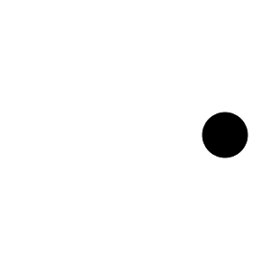
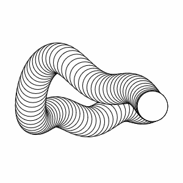
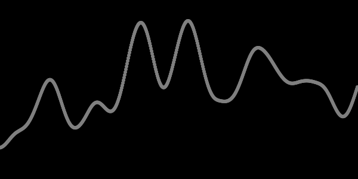

# p5.createLoop

Create animation loops with noise and GIF exports in one line of code. This library is a lightweight wrapper of [createLoop](https://www.npmjs.com/package/createloop) and provides a simple and structured workflow for creating animation loops in p5.js.

Features include:
- GIF image rendering
- noise loops

**Ye be warned** This is a baby library and has a lot of growing up to do. Bugs and breaking changes ahoy.

## Example



html:
```html
    <script src="https://cdnjs.cloudflare.com/ajax/libs/p5.js/0.8.0/p5.min.js"></script>
    <script src="https://unpkg.com/p5.createloop@latest/dist/p5.createloop.js"></script>
```

javascript:
```js
function setup() {
    createCanvas(400, 400)
    fill(0)
    frameRate(30)
    createLoop({duration:3, gif:true})
}

function draw() {
    background(255)
    translate(width / 2, height / 2)
    const radius = height / 3
    const x = cos(animLoop.theta) * radius
    const y = sin(animLoop.theta) * radius
    ellipse(x, y, 50, 50)
}

```

## More examples

### [Noise Loop](examples/js/noiseLoop.js)

- Begins recording the GIF after the first loop
- x position is cosine of animLoop.theta



### [Noise Loop 2x](examples/js/noiseLoop2x.js)

- two noise seeds, one for x and one for y


### [Noise Loop 1D](examples/js/noiseLoop1d.js)

- a noise value for each x position



### [Noise Loop 2D](examples/js/noiseLoop2d.js)

- a noise value for each x and y position


### [Instance Mode](examples/js/instanceMode.js)

- also works in instance mode


## Documentation

p5.createLoop works to make creating animation loops feel native to p5. The built in p5 `frameRate()` function will also set the delay between GIF frames.
The GIF encoder [gif.js](https://github.com/jnordberg/gif.js) uses web workers to render the GIF asynchronously. By default, the GIF will be rendered alongside the sketch and can be downloaded by clicking on it.

When a sketch is initialized the following are attached to it.

### createLoop()

This function can be called in two ways:
```javascript
createLoop(options)
createLoop(duration,options)
```

### createLoop()

This method in the global namespace will return a loop instance. It can receive servarl arguments:

| Name              | Default   | Description                                                                                                                                |
| ----------------- | --------- | ------------------------------------------------------------------------------------------------------------------------------------------ |
| `duration`        | `3`       | sets the duration in seconds of the loop.                                                                                                  |
| `framesPerSecond` | `30`      | approximate fps of the loop                                                                                                                |
| `noise`           | `options` | See [noise options](README.md#noise-options)                                                                                               |
| `gif`             | `false`   | can accept `true` or `options` to be passed to GIF module. Will not create GIF if left undefined. See [gif options](README.md#gif-options) |

```js
//Options can be passed as an object
createLoop({
    noise:{
        radius:3,
        seed:99
    }
})
//or as camelCase
createLoop({
        noiseRadius:3,
        noiseSeed:99
    })
```

#### noise options

| Name     | Default                  | Description                                                                                                    |
| -------- | ------------------------ | -------------------------------------------------------------------------------------------------------------- |
| `radius` | `1`                      | radius of the circle in a noise field to query                                                                 |
| `seed`   | `Math.random() * 999999` | noise field offset                                                                                             |
| `theta`  | `loop.theta`             | By defalt is elapsed loop progress around a circle. This can be set in noise functions but not in `createLoop` |


#### gif options

| Name        | Default     | Description                                                                                                             |
| ----------- | ----------- | ----------------------------------------------------------------------------------------------------------------------- |
| `render`    | `true`      | create an image element and render the GIF to the webpage. Clicking on the image will begin downlaoding the GIF         |
| `open`      | `false`     | open the gif image in a new tab or window                                                                               |
| `download`  | `false`     | download the gif automatically                                                                                          |
| `fileName`  | `image.gif` | name of the downloaded GIF file                                                                                         |
| `startLoop` | `0`         | loop index to begin recording the GIF                                                                                   |
| `endLoop`   | `1`         | loop index to end recording the GIF                                                                                     |
| `canvas`    | `<canvas>`  | the canvas to render. By default this is the first instance of a canvas on the webpage                                  |
| `options`   | `{}`        | options to pass to gif.js encoder. see [gif.js documentation](https://github.com/jnordberg/gif.js#user-content-options) |

### animLoop

Because the aim here is to get GIF loopin asap, this object provides some valuable properties and methods for animating loops. See documentation on [Loop Instance](https://github.com/piratesjustar/createLoop#loop-instance) for further details.

| Name                   | Description                                                                                                                                           |
| ---------------------- | ----------------------------------------------------------------------------------------------------------------------------------------------------- |
| `progress`             | stage of completion of the loop. this is `elapsedFrames / framesPerLoop` and has a range of `0 to 1`                                                  |
| `theta`                | progress around a circle with a a range of `0 to TWO_PI`                                                                                              |
| `noise(options)`       | returns a noise value between -1 and 1 from position `theta` with `radius` on a circle in a noise field. See [noise options](README.md#noise-options) |
| `noise1D(x,options)`   | Same as above also accepting an `x` value, providing a 1D line of noise for each frame                                                                |
| `noise2D(x,y,options)` | Same as above also accepting a `y` value, providing a 2D plane of noise                                                                               |
| `noiseSeed()`          | set the noise seed                                                                                                                                    |
| `noiseRadius()`        | set the default noise radius                                                                                                                          |


### TODO

- Account for pixel density with GIF size

### patch notes
- 0.0.18 - 15/04/2019
    - updated to createLoop 0.0.7
- 0.0.17 - 15/04/2019
    - updated to createLoop 0.0.6
- 0.0.16 - 15/04/2019
    - can handle webpack without adding p5 to global namespace
- 0.0.15 - 15/04/2019
    - p5 must be externally required
- 0.0.12 - 15/04/2019
    - remove full size images from package
- 0.0.11 - 15/04/2019
    - removed p5 from bundle
    - where p5._targetFrameRate is undefined, uses p5._frameRate instead
- 0.0.10 - 15/04/2019
    - enabled use as a package
    - added p5 as dependency
- 0.0.6 - 15/04/2019
    - compressed example images
- 0.0.4 - 14/04/2019
    - fixed README image bug
- 0.0.2 - 14/04/2019
    - using script tags in examples
- 0.0.1 - 14/04/2019
    - initial release